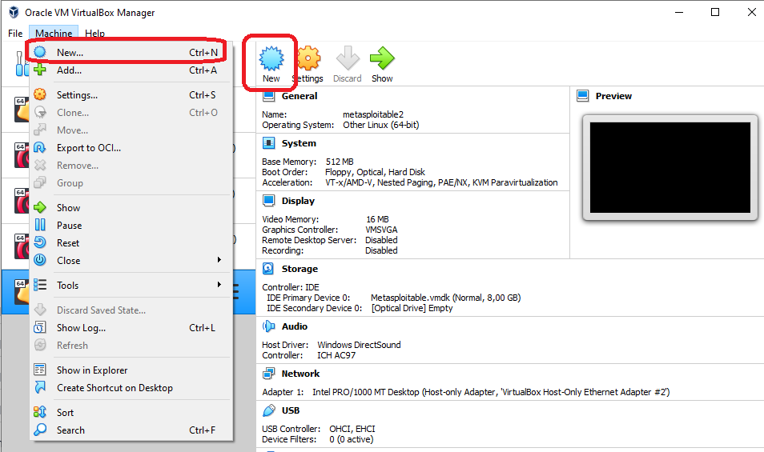
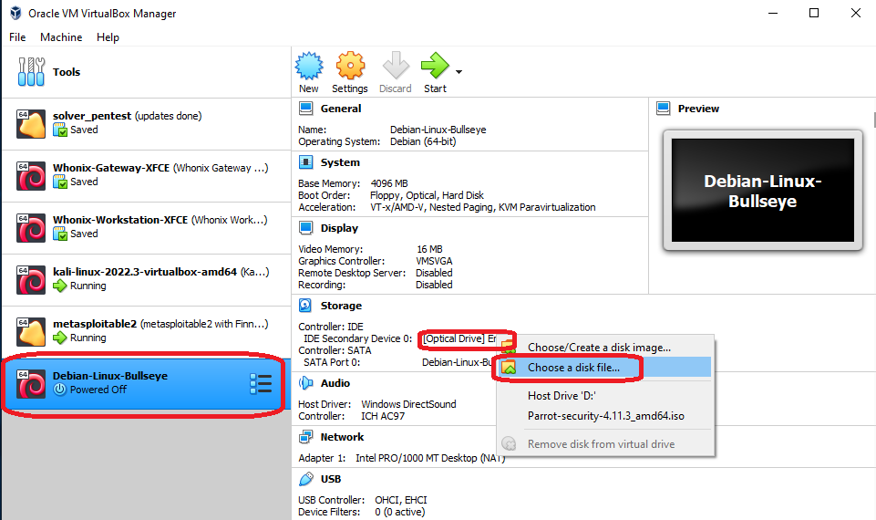
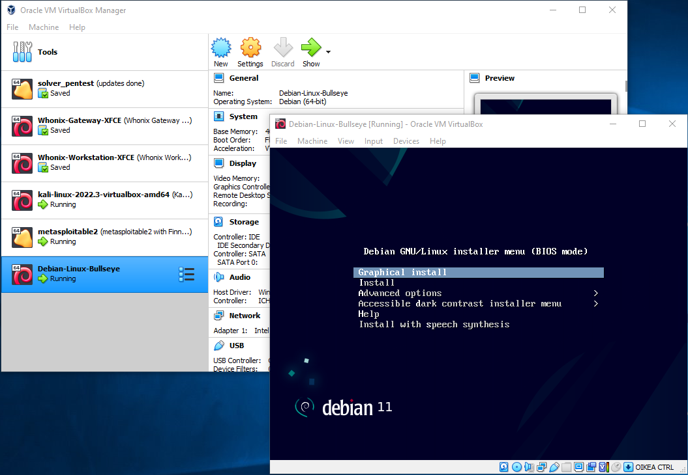
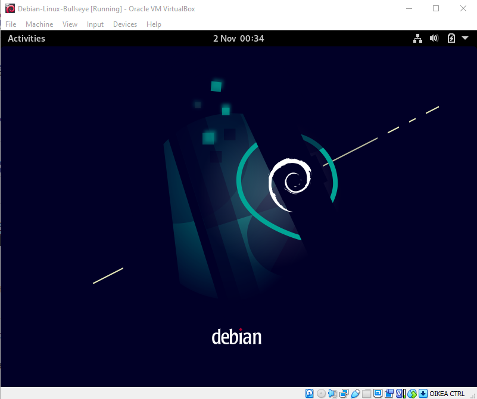
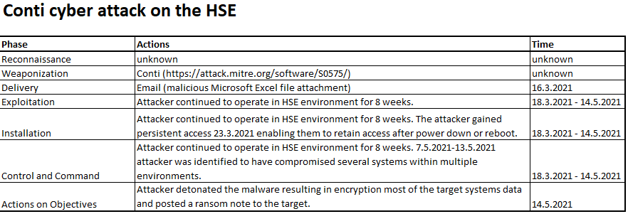

# Adversarial mindset (h1)

## Installing Debian Linux on VirtualBox (h1-c)

I checked out a few resources where you can download ready-made images for VirtualBox but instead decided to do the installation from scratch myself just to get as close to the source as possible. If you're interested in just downloading the VirtualBox image here are a few sites that I found:

+ [OSBoxes](https://www.osboxes.org/debian/)
+ [Linux Images](https://www.linuxvmimages.com/)

But for now let's go forward with the from scratch installation. Since I already have VirtualBox installed the process looks a bit more straightforward:

1. Download the installation media for your Debian build of choice
2. Create a new VM in VirtualBox
3. Mapping the installation media for the created VM
4. Installation of Debian Linux 11.5.0 "Bullseye"

### Downloading the Debian ISO-image

I went to https://www.debian.org/download to get the latest build for Debian and downloaded the amd64 ISO-image from there. Also it's good to verify the file integrity by confirming that the checksums match.

Since I'm running Windows on my host I checked the checksum using Powershell:

```
Get-FileHash -Path '.\debian-11.5.0-amd64-netinst.iso' -Algorith SHA512 | Format-List
```


I compared the result to what I found on the download site and it matched so we can be sure that the file we have here locally is identical to the file debian.org meant to share.

### Creating the VirtualBox machine

Next step is to create the VM in VirtualBox. For this we need to check the minumum requirements for the VM and check how our host is equipped to handle these requirements. As my host computer I'm using a custom-built rig that I made from selected components:

+ Asus Prime X570-P motherboard
+ AMD Ryzen 7 3700X 8-Core Processor
+ 32GB RAM
+ NVIDIA GeForce RTX 2080 SUPER GPU
+ Samsung SSD 970 EVO Plus 1TB storage
+ OS: Windows 10 Enterprise version

Debian linux minimum requirements are quite low so with 780MB of RAM and 920MB of storage you can perform a normal installation of Debian "Bullseye" release and one can go even lower if you're an experienced user (Source: https://www.debian.org/releases/bullseye/amd64/ch02s05.en.html). With a desktop GUI installed the requirements are naturally higher as described here: https://www.debian.org/releases/bullseye/amd64/ch03s04.en.html.

Based on this information I'm comfortable for my use to allocate the virtual machine with 4 virtual CPU cores, 4GB of RAM and 10GB of disk to enable running desktop GUI on the machine. Good thing about virtual machines is that one can easily allocate less or more resources to it based on what it is used for at that time. Few screenshots below for guidance.




###  Maping the installation media for the created VM

As a next step I needed to bind the downloaded installation media to the virtual machine to start the installation process for Debian. This is done by selecting the drive from under the newly created virtual machine settings:



And there we go, the virtual machine is now ready to be started and it will automatically boot from the ISO-file since no OS is yet installed to it.



###  Installing Debian Linux 11.5.0 "Bullseye"

There are a lot of installation options that one can choose from when installing Debian. I decided to go with the graphical installation. As there are tons of guides on how to install Debian 11 with great screencaptures I won't use my time on copy/pasting screencaptures for the whole process but instead will provide you this link if you're interested in seeing what the whole installer looks like: https://linuxopsys.com/topics/install-debian-on-virtualbox.

One tip related to VirtualBox though is the use of CLI to manage your VirtualBox input device. VBox* type commands are found from your VirtualBox installation folder and these commands can be useful for example when you need to input disk encryption passwords or other passwords from your password manager to the virtual machine in situations where there is no copy/paste available for the input field. Here is an example that sends the string of your definition to the virtual machine and after sending the password string hits 'enter':

```
./vboxmanage controlvm PutYourOwnVirtualMachineNameHere keyboardputstring 'my disk encryption password goes here'
./vboxmanage controlvm PutYourOwnVirtualMachineNameHere keyboardputscancode 1c 9c
```

On my installation options I ran the setup for the system with many of the default setting and without disk encryption. I also partitioned my disk to single partition for the OS and separate partition for swap. For my desktop environment I chose Gnome. I usually go with Xfce so I decided for this installation to try GNOME instead. And there it is a clean Debian 11.5.0 "Bullseye" installed.



## Darknet Diaries (h1-x)

### Episode 121: Ed

In this episode Ed Skoudis shared a few stories from his pentesting career. First story he shared was from when he was doing pentesting for a hospital environment. From the outside network perspective everything was quite well hardened but when they proceeded to the internal network they found exploitable vulnerabilities on unpatched computers. One vulnerability that they went on to exploit as agreed with the customer was related to a laser cutting surgery tool and they ended up in a pretty hairy situation as the system was actually used in surgery when they gained access to the it.

Another case he shared was when they were testing a toymakers toy device and they found that the toy is susceptible to replay type of vulnerability which means that the device would accept any commands replayed to it even if they were coming from malicious sources like an attackers transmitter. Initially the client was thinking of going to production with the vulnerability but after the pentesters revised their report to relate to more concrete risks that would cause the client liability they ended up fixing the vulnerability before going to production.

Topics discussed:
+ Penetration testing
+ Network scanning with NMAP
+ Exploiting vulnerabilities

Key takeaways:
+ Make sure to have clear agreements and scope of work with the clients in case of backfire
+ Try to work in a manner where little or no harm is caused while testing or exploiting systems
+ In reports use arguments that relate to concrete and actionable risks by the clients

### Summary of white-paper "Hutchins et al 2011: Intelligence-Driven Computer Network Defense Informed by Analysis of Adversary Campaigns and Intrusion Kill Chains" (h1-x)
White-paper source: https://lockheedmartin.com/content/dam/lockheed-martin/rms/documents/cyber/LM-White-Paper-Intel-Driven-Defense.pdf

This paper introduces the intrusion kill chain in respect to computer network attacks and espionage. The paper derives it's intrusion kill chain model from the US military doctrine (F2T2EA). The intrusion kill chain consist of 7 phases: Reconnaissance, Weaponization, Delivery, Exploitation, Installation, Command and Control and Actions on Objectives. In the paper it is described that successfull counter measures at any of these stages would be enough to prevent the attack from succeeding.

They also presented how analysing different intrusion campaigns can help to identify key indicators that can be used to detect and prevent future attacks and presented a case study from actual intrusion attempts towards the Lockheed Martin network.

The white-paper also emphasizes that a more thorough and broad scope is needed to counter these Advanced Persistent Threats (APT) and that the intrusion kill chain methodology would help here.

### MITRE ATT&CK summary
Source: https://attack.mitre.org/
#### Tactic
Source: https://attack.mitre.org/tactics/enterprise/
Tactics in ATT&CK framework means the goals of the adversary what they're trying to achieve. In the enterprise matrix examples could be TA00002 which is the ID for Execution type tactics where the adversary tries to run malicious code in the target system. The ATT&CK framework has 14 tactics categories (https://attack.mitre.org/tactics/enterprise/).

#### Technique
Techniques in ATT&CK framework describes the ways how the adversary would be attacking towards in respect to their tactics/goals. ATT&CK framework techniques often also have sub-techniques to differentiate between multiple ways of success in the main technique category. For example the attacker could use T1548 which is the ID for a collection of techniques to abuse elevation control mechanism to allow the execution of malicious code in the target system. ATT&CK describes total of 193 techniques which consist of 401 sub-techniques.
Source: https://attack.mitre.org/techniques/enterprise/

#### Procedure
Procedures in ATT&CK describes the combination of specific tools and techniques used for a specific types of attacks and what abilities the procedures have in that respect. For example one procedure with ID S1039 named "Bumblebee" describes a Windows malware capable of multiple techniques described in the ATT&CK framework (https://attack.mitre.org/software/S1039/).
Source: https://attack.mitre.org/resources/faq/

In the ATT&CK knowledge base there are also mitigation techniques described and a lot of useful information regarding threats in general.
## Comparison between ATT&CK Enterprise matrix and Cyber Kill Chain (h1-a)
To me it seems that the main difference between ATT&CK and the intrusion kill chain as described in the white-paper is the depth of detail. The intrusion kill chain describes in general main phases for a successful cyber attack where as ATT&CK goes into more detail regarding specific types of attacks and how they're done in practice and what systems the attacks target.

ATT&CK Enterprise Matrix (https://attack.mitre.org/matrices/enterprise/) techniques for example could be categorized under the cyber kill chain phases. In my opinion the ATT&CK Enterprise Matrix has more value for the specialists doing the work and intrusion kill chain could be better for communicating issues for management.

## Conti cyber attack on the HSE (h1-b)
In the spring of 2021 HSE, an organization operating all of the public health services in Ireland, was targetted with a ransomware attack. Here is a short summary I made of the attack based on the intrusion kill chain framework.



The attacker ended up publishing the decryption key to the target which allowed them to start decrypting the systems. This attack affected HSE and it's customers for several months after the decryption key had been obtained.

Sources:

PwC "Conti cyber attack on the HSE" -report (https://www.hse.ie/eng/services/publications/conti-cyber-attack-on-the-hse-executive-summary.pdf)

HSE website (https://www.hse.ie/)