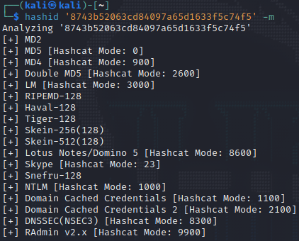
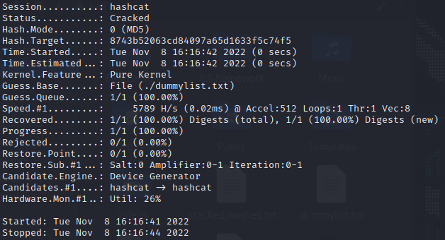
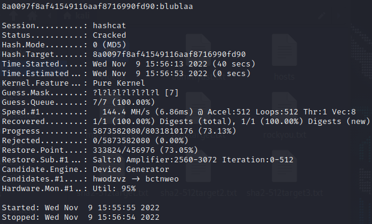
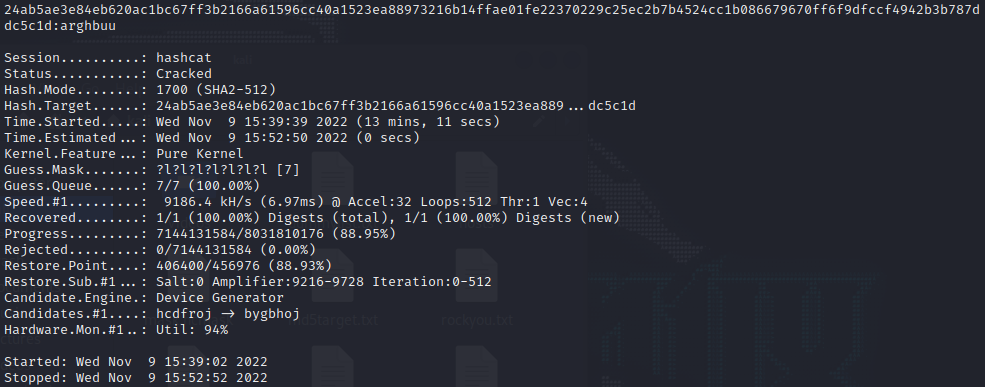
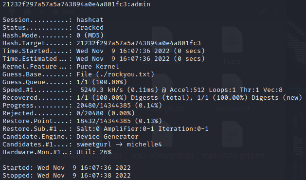
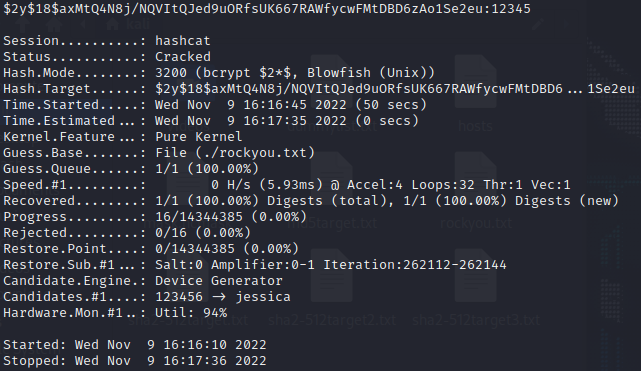

# ICT Security (h2)

## Applied Cryptography (h2-x)

In the chapter 2.3 and 2.4 Mr. Bruce Schneier gives an introduction to one-way functions and one-way hash functions. The basic idea of a one-way hash function is:
+ running data trough one-way hash function is fast
+ result of the one-way function is very hard to reverse engineer to get data from the result
+ it's very hard to get same result from a one-way hash function with any difference in the original data
+ function takes variable-length input and converts it to a fixed-length output
+ public access to hash functions means there is no secrecy involved and everyone can use them
Use cases for one-way hash functions:
+ fingerprinting / verifying that the information received is as it was/is on the sender side (backups, downloads)
+ storing and verifying passwords
+ verifying that data inside a system has not been altered (rootkit, tracking changes)

## Cracking Passwords with Hashcat (h2-x)

Hashcat is basically a brute force tool for cracking hashed data with dictionaries or masks. Hashcat supports many of the common hash functions available. There are two versions of hashcat available where the preferred newer version of the app utilizes GPU with CPU and thus is a lot faster in cracking the hashes. Hashcat offers the possibility to save the results into a file and offers status data with performance information out of the box.

One of the popular dictionaries "rockyou.txt" was recommended in the article but it is possible to download other dictionaries, create your own dictionary, and do cracking with a mask attack (https://hashcat.net/wiki/doku.php?id=mask_attack).

## Command Line Basics Revisited (h2-x)

In this article some of the most common CLI commands were introduced along with how to operate in CLI. Good basics intro.It might be a good idea to include some basic network related commands like ip, ping, and possibly some additional details on cat, echo, less, grep and piping.

## Install hashcat and test that it works (h2-a)
I have hashcat installed on a Kali Linux setup by default so I will move on straight to testing it. I found some hashes for testing purposes from the hashcat site: https://hashcat.net/wiki/doku.php?id=example_hashes. The example hashes should all return password "hashcat" unless otherwise detailed.

I'll test a couple of the more common hashes and see what results I get.

### MD5
hash: 8743b52063cd84097a65d1633f5c74f5

First off we analyze the hash with hashid using the -m option which adds the hashcat mode id to the results.
```
hashid '8743b52063cd84097a65d1633f5c74f5' -m
```


Next we will try to crack it using hashcat with the dictionary attack mode utilizing the popular rockyou -dictionary.
```
hashcat -a 0 -m 0 '8743b52063cd84097a65d1633f5c74f5' ./rockyou.txt
```

No luck there! Lets try with our own dictionary with just the "hashcat" in it.



So it seems to be working! Let's try also using the brute-force and mask attack mode with iteration
```
hashcat -a 3 -i -m 0 '8743b52063cd84097a65d1633f5c74f5' ?l?l?l?l?l?l?l
```



### SHA2-512

After this I wanted to try the same with SHA2-512 hash but I ended up using the --show parameter in the wrong way and had to debug the commands for quite a long time. As it turns out the --show parameter only shows you the result and you can't pair that with a hashcat operation that hasn't finished yet. Anyways I got the syntax fixed and managed to test some SHA2-512 hashes with brute-force and a mask file.



As expected brute-forcing without a dictionary is quite slow and thus this ended up taking quite a bit of time. Here the mask only consisted of lowercase alphabets with a length of 7 characters so imagine what this would mean for 20 characters with special characters and numbers in it.

## Crack this hash: 21232f297a57a5a743894a0e4a801fc3 (h2-b)
First off I checked the hash with hashid which detected that the hash would fit ~15 different hashtypes. From these I chose to try out MD5 first as it is quite commonly used hashtype.
```
hashcat -a 0 -m 0 '21232f297a57a5a743894a0e4a801fc3' ./rockyou.txt
```
Turns out I was right and I got a result quite fast.



## Crack this Windows NTLM hash: f2477a144dff4f216ab81f2ac3e3207d (h2-c)
Here I checked the hashcat id for NTLM hash first which showed '1000'.
```
hashcat -h |grep NTLM
```
Then I went on to try and crack it with the rockyou.txt dictionary...
```
hashcat -a 0 -m 1000 'f2477a144dff4f216ab81f2ac3e3207d' ./rockyou.txt
```
and the result came in pretty swiftly 'monkey'.

## Try cracking this hash and comment on your hash rate: $2y$18$axMtQ4N8j/NQVItQJed9uORfsUK667RAWfycwFMtDBD6zAo1Se2eu (h2-d)
This seemed to be either Blowfish or bcrypt and hashcat said it would take approximately 1 year and 199 days to go trough all the iterations from the rockyou.txt dictionary which seemed daunting.


However the operation finished in just 50 seconds with the result '12345'.



It was a bit surprising that the time to go trough the rockyou.txt dictionary was that long as compared to SHA2-512 brute-force with mask estimate was only like 19 minutes or so. The speed of the operation here showed 0 hashes / second and on the SHA2-512 bit it was 9186.4 kH/s (kilohash) so hashcat according to these statistics is a lot faster in cracking SHA-512 than bcrypt/Blowfish.