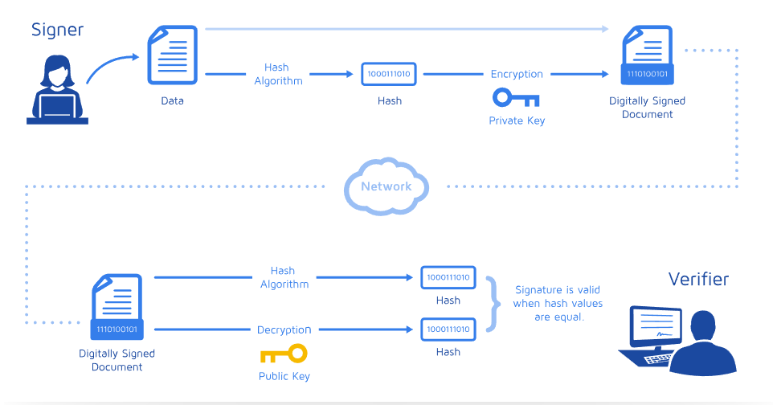

# Public key cryptography (h3)

## Applied Cryptography (h3-a)
Task here was to read and summarize sections from chapters one and two of Bruice Schneiers 2015 book "Applied Cryptography".
### Foundations
Source: https://learning.oreilly.com/library/view/applied-cryptography-protocols/9781119096726/08_chap01.html#chap01

+ The art and science of keeping messages secure is called cryptography
+ Cryptographic algorithms are called ciphers
+ There are two general types of key-based algorithms: symmetric and public-key
+ Cryptanalysis is the science of recovering plaintext of a message without access to the secret key
+ Three most common cryptographic algorithms are DES, RSA, and DSA
+ Mr. Schneier uses various large numbers to describe different things in cryptography and therefore physical analogues are useful to signify the meaning

### Protocol Building Blocks
Source: https://learning.oreilly.com/library/view/applied-cryptography-protocols/9781119096726/10_chap02.html#chap02-sec005

+ Public-key cryptography as we know it was invented by Whitfield Diffie and Martin Hellman in 1976
+ Public-key cryptography is based on keypairs of public and private keys where public key is used to encrypt the message and private key is used to decrypt it
+ Using public-key cryptography you have no need and must not reveal your private key to anyone but the public key can be distributed freely
+ Symmetric algorithms are generally 1000 times faster compared to public-key algorithms
+ Hybrid cryptosystems are described as systems where public-key cryptography is used to secure and distribute session keys which are used to secure message traffic (HTTPS for example)
+ Digital signatures are used to verify that the data is as it was in the original form and that the signee has in fact signed the data
+ Digital signatures can be forged and used to sign altered data but the cost of doing that is very high in terms of difficulty and risk of detection
+ Public-key algorithms are often considered too inefficient to sign large amounts of data thus signing a hash of the data offers some benefits in common applications of signatures

## Examples of Public Key Cryptography (h3-b)

### HTTPS
This is propably the most common use case for public key cryptography. We use this multiple times a day when browsing the internet, paying our bills, etc. To keep our internet activities safe websites rely on HTTPS to encrypt data in transit between the server and the client. This encryption is done using certificates which relies on public key cryptography.

Here the webserver has been issued a certificate by a CA (certificate authority) and they're using that certificate to distribute their public key. Now when you browse to a HTTPS-site the first thing will be that the server sends your client the certificate and should it be a trusted certificate your browser will automatically start using the public key there to encrypt the traffic to that webserver. The first thing happening here will be a key exchange after which all the communication will be then encrypted between the client and the server.

### Digital Signatures
Often times when doing business over the internet it is needed to verify that the entity you're dealing with is actually who they say they are and that the data sent to you is actually coming from that particular entity. Here is where digital signatures come into play. Let's say I would like to sign a legally valid contract with a company online. They would need to verify that it's indeed me who is signing the contract.

Digital signatures work with public key cryptography so that upon signing the contract the signee will actually create a digital signature using their private key. Here is a good illustration from DocuSign (https://www.docusign.com/how-it-works/electronic-signature/digital-signature/digital-signature-faq):

## Encrypt and sign a message (h3-c)
Task here was to test encryption and I decided to do the test by using two fictional entities on my local computer

1. Create a plaintext message `echo testmessage > plaintext.txt`
2. Download & install GPG if you don't have it installed yet (gnupg.org)
3. Create a keypair for the recipient `gpg --full-generate-key`
4. Create a keypair for the sender `gpg --full-generate-key`
4. Use the recipient public key to encrypt the plaintext.txt and use the sender private key to sign the ciphertext.txt `gpg -s -a -o ciphertext.txt -e plaintext.txt` (option -a is used to ASCII armor the ciphertext.txt)
5. Use the recipient private key to decrypt the ciphertext.txt as received_plaintext.txt `gpg -o received_text.txt -d ciphertext.txt`
6. Check the gpg output for verification on the sender signature (here the senders public key is used to verify the signature).
7. Check that the contents of the message match with your plaintext.txt `diff plaintext.txt received_text.txt`

