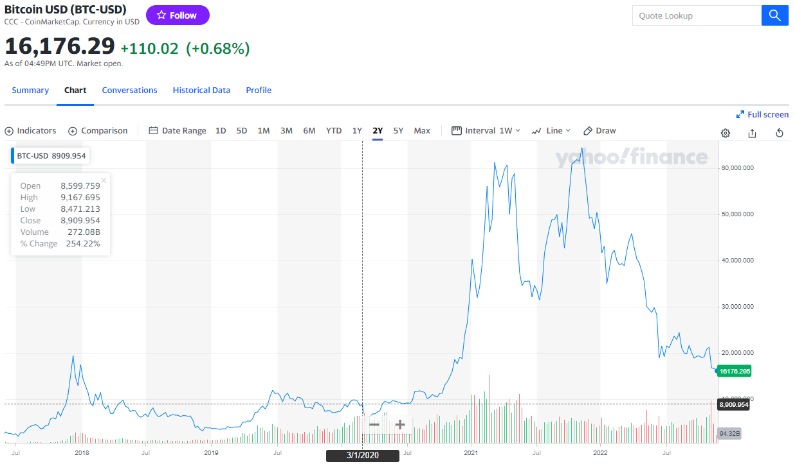

# BitCoin intro
https://terokarvinen.com/2022/trust-to-blockchain-2022-autumn/

## Read/watch and summarize (h4-x)

### [Nakamoto, Satoshi 2008: Bitcoin: A Peer-to-Peer Electronic Cash System](https://bitcoin.org/bitcoin.pdf)
+ Bitcoin: A Peer-to-Peer Electronic Cash System (https://bitcoin.org/bitcoin.pdf) by Satoshi Nakamoto is a description of BitCoin and the use of block chain as a solution to prevent double-spending
+ The model bases on system having collectively more honest nodes with more computing power than what dishonest hosts could have
+ If an attacker does manage to gain more computing power than 50% they would be able to modify their own transactions or generate new coins and the incentive would be greater to create new coins
+ First transaction in a block is a special transaction that starts a new coin owned by the creator of the block which serves as an incentive to keep running a node, later the incentive can be in a form of transaction fee
+ Network works on peer-to-peer basis where all transactions are broadcast to all nodes
+ Disk space can be saved using a Merkle Tree and stubbing off branches from it
+ Privacy can be maintained by keeping public keys anonymous but here is still the risk that some party might lose anonymity if multiple transactions can be linked to an identifiable entity

### [Felten et al 2015: Bitcoin and Cryptocurrency Technologies - Week 1](https://www.coursera.org/learn/cryptocurrency/home/week/1)
+ Properties for a good hash functions are that it's collision-free, puzzle friendly, and has a hiding property
+ Hash pointers are used to prevent tampering of blockchain
+ Binary tree with hash pointers is called "Merkle tree" and it holds many items and membership can be verified efficiently
+ Two main properties for digital signatures is that it can't be copy pasted to other data sources than what it is used to sign and that anyone who has seen your signature would be able to verify that it indeed was your signature
+ Bitcoin uses ECDSA (Elliptic Curve Digital Signature Algorithm) where randomness to secure your private key
+ Public keys can be used as an identity and this is also what BitCoin does and these are reffered as an 'address'
+ Double-spending problem is something every cryptocurrency needs to solve along with solving the problem of centralized management

## BitCoin value (h4-a)
+ BitCoin was introduced in January of 2009 (bitcoin.org)
+ BitCoin is and has been quite volatile currency
+ Late 2017 and early 2018 BitCoin peaked at ~20,000 USD but declined to ~3,200 USD by the end of 2018
+ Investing in BitCoin during 2020-2022 has offered multiple chances for high gains and high losses
+ In August 2020 BitCoin skyrocketed from ~5,200 USD to ~61,200 USD in less than a year
+ Value of one BitCoin in 22.11.2022 according to Yahoo finance was ~16,176 USD (https://finance.yahoo.com/quote/BTC-USD?p=BTC-USD)

## What's a blockchain? (h4-b)
+ Blockchain can be described as cryptographically signed and verified blocks of data linked together creating an immutable chain of blocks
+ Blockchain can be used in many ways to help decentralize trust to enable collaboration globally (https://www.youtube.com/watch?v=qOVAbKKSH10)

Steps to describe how blockchain works:
1. User makes a change to data or initiates a transaction
2. The data / transaction is hashed with the previous block of data, timestamped and signed by the user creating a new block of data
3. The new block is broadcasted to all the nodes part of the network
4. All the nodes validate the block
5. After validation the new block is added to the network creating or adding to the chain of blocks eg. blockchain as the latest link
6. All the nodes will verify the latest block and start using that as the source for the next block

Blockchain can be used to facilitate transactions, serve as a database, used to run code, and much more.

## Not BitCoin (h4-c)
Before BitCoin there were E-Gold, Bit Gold, B-Money, and Hashcash for example attempting to create the first digital currency (https://www.investopedia.com/tech/were-there-cryptocurrencies-bitcoin/). Despite the attempts BitCoin was the first cryptocurrency to reach mainstream with the public. Since the discovery of BitCoin there has been numerous other cryptocurrencies with their own version of software. Some of the most prominent include (https://www.bankrate.com/investing/types-of-cryptocurrency/):
+ Ethereum
+ Tether
+ USD Coin
+ BNB

Some of the cryptocurrencies are described as stablecoin which is a term for cryptocurrency which has it's value pegged to an external asset such as gold or the value of USD. Also there is at least one cryptocurrency that started off as a joke called Dogecoin (https://dogecoin.com/#what-is-dogecoin) which is actually used quite a lot now. The founders of Dogecoin initially created the meme coin to make fun of the cryptocurrencies of the time most namely BitCoin (https://www.forbes.com/advisor/investing/cryptocurrency/what-is-dogecoin/).