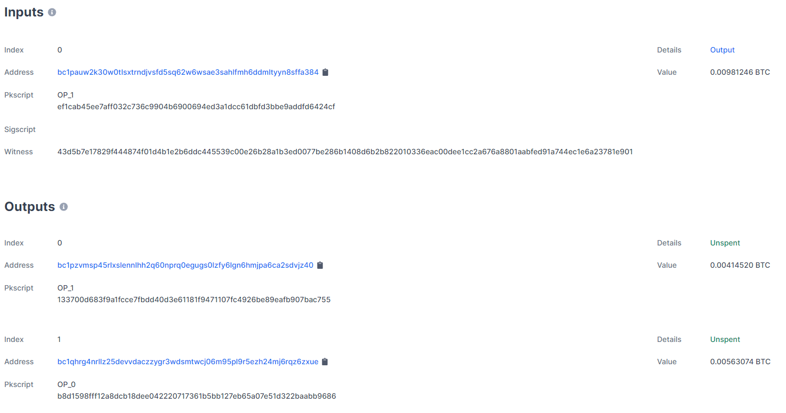
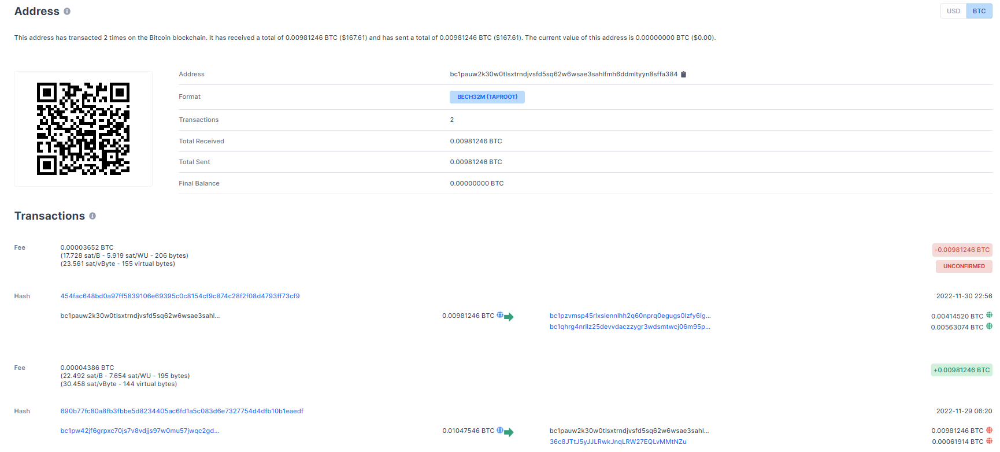
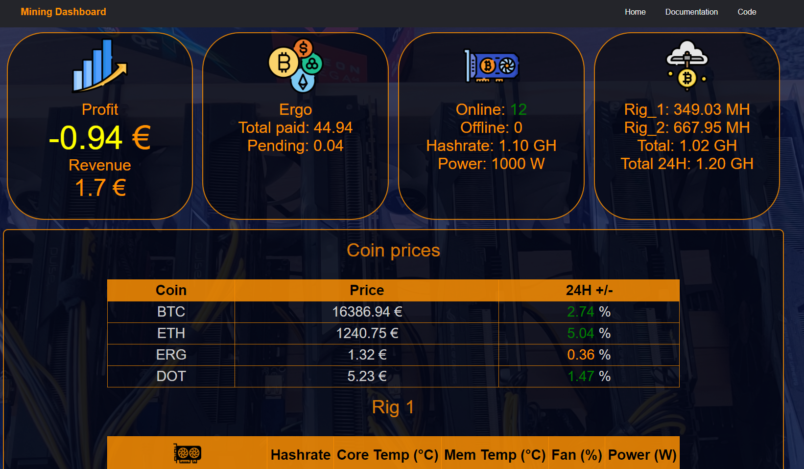

# Bitcoin transactions
Tasks from https://terokarvinen.com/2022/trust-to-blockchain-2022-autumn/ h5.

## [How Bitcoin Achieves Dexentralization](https://www.coursera.org/learn/cryptocurrency/home/week/2)
+ Decentralization is not all or nothing and can be determined on different levels/categories
+ With Bitcoin decetralization is also implemented in different scale depending on the aspect evaluation is done in (Bitcoin software updates, Bitcoin mining, Bitcoin peer-to-peer network)
+ Distributed consensus is a common problem in computer science
+ Bitcoins solution to distributed consensus can be used in many other applications such as DNS
+ Reaching consensus is hard since the network is imperfect, nodes could crash, and nodes could be malicious
+ Pseudonymity is a goal for Bitcoin
+ Double-spending attack is not possible when over 50% of the nodes are honest
+ User needs to be aware of the confirmation status for their transactions to understand verification propability
+ Nodes are rewarded for doing proof of work if they "win" the hash puzzle of verifying a new block to the consensus chain
+ Another possibility to incentivise the verification of blocks are transaction fees
+ Mining for blocks is quite expensive
+ Attacker with 51% of computing power can't steal coins from an existing address or change the block reward

## Analyzing Bitcoin transactions

After some searching I found my way to blockchain.com take a look at some transactions.

The transaction I chose was: [transaction](https://www.blockchain.com/btc/tx/454fac648bd0a97ff5839106e69395c0c8154cf9c874c28f2f08d4793ff73cf9)

Here are some details about the transaction:

Here we can see that the total value taken from the address was 0.00981246 BTC. Output to other addresses was 0.00977594 BTC which leaves 0.00003652 BTC for transfer fee. Value of this amount of Bitcoin was 166.61$ based on the BTC value at the time of the transaction.

Further analysing the transaction it could be seen that the Bitcoin was sent to two other addresses.

Looking at the address sending the Bitcoin we can see that it has only two transactions in transaction history and the first one was made 29.11.2022 so this address is quite new in the network.

Here we can see that should the currently unconfirmed transaction go trough, this address would have 0 BTC as final balance.

## [Miko Hirvelä's crypto mining dashboard](https://mikohirvela.fi/cryptomonitoring)
Based on this dashboard Miko is mining Ergo with 12 display adapters. It seems he has updated the dashboard since my last visit with cool graphics! At current power prices and coin prices his rig is running pretty much break even. I'm not sure if this takes into consideration the investment of time and materials for the rig but for me mining based on this dashboard wouldn't be reasonable.

Of course the value of the coins mined could go up while holding so there is always this upside. Maybe in the future miners would get more out of transaction fee's than block rewards.