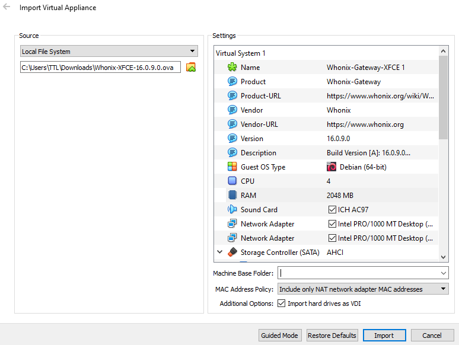
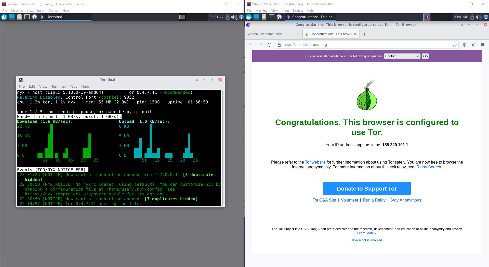
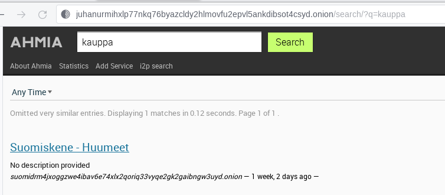
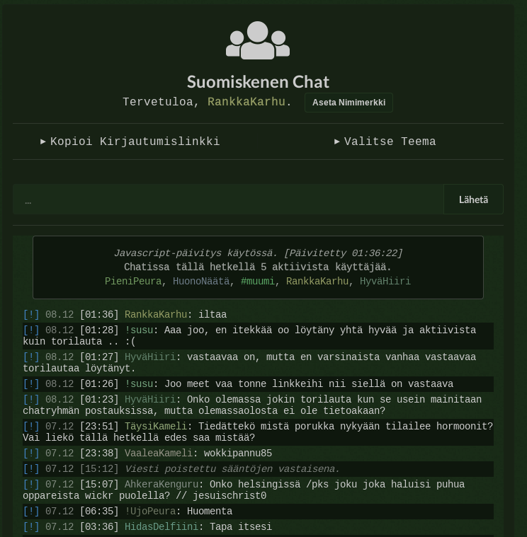

# Onion
Tasks from https://terokarvinen.com/2022/trust-to-blockchain-2022-autumn/ h6.

## [Hiding Behind the Keyboard: The Tor Browser (h6-x)](https://learning.oreilly.com/library/view/hiding-behind-the/9780128033524/XHTML/B9780128033401000021/B9780128033401000021.xhtml#s0010)
+ Tor was initially developed by US government in 2002
+ Tor can be used for legimite and illegal actions
+ Tor uses a guard / entry node which can be same for some time but the next nodes are changed per site
+ Last hop of the chain can be unencrypted
+ Using Tor is easy and doesn't require a lot of techincal expertise
+ Using Tor doesn't mean that forensic information can't be recovered from the computer
+ Using Tor doesn't guarantee anonymity as users tend to make errors and there are some cases where deanonymization is possible
+ Disabling majority of Tor nodes or gaining access to many exit nodes might offer the possibility to deanonymize users
+ Tails is an OS that can be used anonymously and doesn't persist any data on disk

## Tor installation (h6-a)
I decided to go for a Whonix (whonix.org) setup with VirtualBox. Other options could have been to just install Tor browser (torproject.org), use Tails (https://tails.boum.org/), or Cubes (https://www.qubes-os.org/). Fun fact, Edward Snowden seems to use all of these options based the quotes the sites are using :D

Anyways, I downloaded the Whonix VirtualBox image and corresponding SHA512 fingerprint from https://www.whonix.org/wiki/VirtualBox. As I'm using a Windows system I verified the hash with

```
Get-FileHash .\Whonix-XFCE-16.0.9.0.ova -Algorithm SHA512| Format-List
```


After verifying that the hashes matched I continued to install Whonix by using the import function on the VirtualBox from "File > Import Appliance".



Then I fired up the Whonix gateway and after going through a few "I understand" -clicks I was ready to fire up Whonix workstation. Same thing there and after few clicks it was time to change my keyboard layout to Finnish (https://www.kicksecure.com/wiki/Keyboard_Layout) and the default user password from "changeme" to something else with `passwd`.

After a quick reboot I was set for Onion browsing. Used Nyx on the Whonix gateway to see that traffic was routing properly through it.



## Browse Tor network
Here I went for the Finnish Ahmia search engine to check for some results in Finnish. My first search was 'kauppa'.



This resulted in one link to a site called 'Suomiskene - Huumeet' which seemed to have a lot of discussion about drugs in particular. The site itself though claimed to be a platform for all kinds of talk but somehow I just found drug-related information. The site itself was very slow and timed-out a lot.


I also found a chat there which seemed to have a few members discussing about 'torilauta' which I presume was a chat in Tor network mostly for dealing drugs.



After trying Ahmia out I decided to opt for another search engine called 'Torch'. Here I typed in the search for 'marketplace' which resulted in quite a lot of illegal sales items related sites.


Most of these sites are propably just fraudulent scam sites and most of the forums and chats I found were about drugs or illegal stuff in general.


A few "legit" sites could be found too like ProtonMail, and ProPublica.


## Anonymity in Tor network (h6-c)
Anonymity works in Tor network as it does in the internet in general except for the fact that your IP is hidden behind three relays and the traffic between relays is encrypted with TLS making it possible to be anonymous in most cases. This anonymity is lost when the user uses any services with his or her usernames or passwords that can be linked to the identity of the user.

## Tor threat model (h6-d)
Tor is vulnerable to deanonymization in cases where the attacker has access to the entry node and the exit node. Here the attacker could for example compare the traffic patterns to determine the user. This kind of attack requires a lot of bandwidth from the attacker to be able to control many of the nodes in the Tor network. This kind of deanonymization could also take place when the attacker has wide network access to be able to monitor the traffic streams across the network to match these streams. Being able to do traffic correlation poses a great risk for the users anonymity.

Source: https://www.freehaven.net/anonbib/cache/ccs2013-usersrouted.pdf