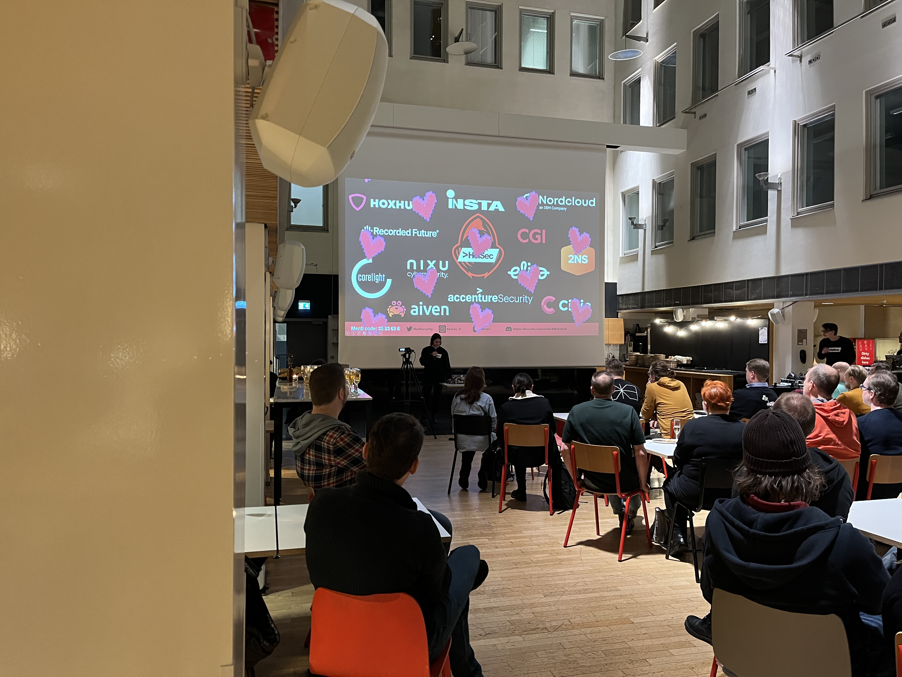

# HelSec
Task h7 from https://terokarvinen.com/2022/trust-to-blockchain-2022-autumn/.

## Infosec by Ilta-Sanomat – how to bring the news from the experts for the good of everyone by Henrik Kärkkäinen
Henrik held an interesting talk on how Ilta-Sanomat being one of the top tabloids in Finland with reach on over 3 million people write news about infosec. Here's a short summary in bullets:

+ Henrik Kärkkäinen has worked for over 20 years in print and online media for Mikrobitti, Digiviikko, and Ilta-Sanomat.
+ Ilta-Sanomat writes about infosec and digitalization for all demographies so the language used needs to be understandable for all. Challenge here for the reporters is to not make themselves fools in the eyes of the experts while doing that.
+ Terminology and language is important when writing the news. Using terms like cracker (that was sometime ago a reference to someone doing criminal hacking) is no longer understood by the general public. These days hackers are not good or bad but it's rather reference to a skillset one could master. Modern terms used are white hat hacker for someone working as pentester for example and black hat hacker is a reference to an attacker with malicious criminal intent.
+ Henrik thinks that click-bait is fine as long as the article delivers what is promised in the headlines. Misleading headlines are not good journalism.
+ People like to read about other people and stories that have happened to other people are interesting to us. Personalizing an article with name and age makes it a lot more interesting.
+ Victims of cybercrime such as phishing or fraud are often too ashamed to report the issue or come forward. A lot of these stories are left untold due to this. Discussing with friends and colleagues about these situations openly reduces shame and so does every article about these victims and stories about online fraud.
+ Henrik is eager to discuss with professionals the technical side of things and constantly asks for comments and input from experts. Many times his contacts are too busy or otherwise unavailable for comments and often it's only the fourth or fifth contact who is able to give insight on the story at hand.
+ Intimidation has no place in covering infosec issues and Henrik showed a couple of examples where infosec companies used intimidation tactics in their communication and sales where he then had countered them with articles debunking their intimidation tactics.

Overall a great presentation and a lot of questions and discussion followed.

