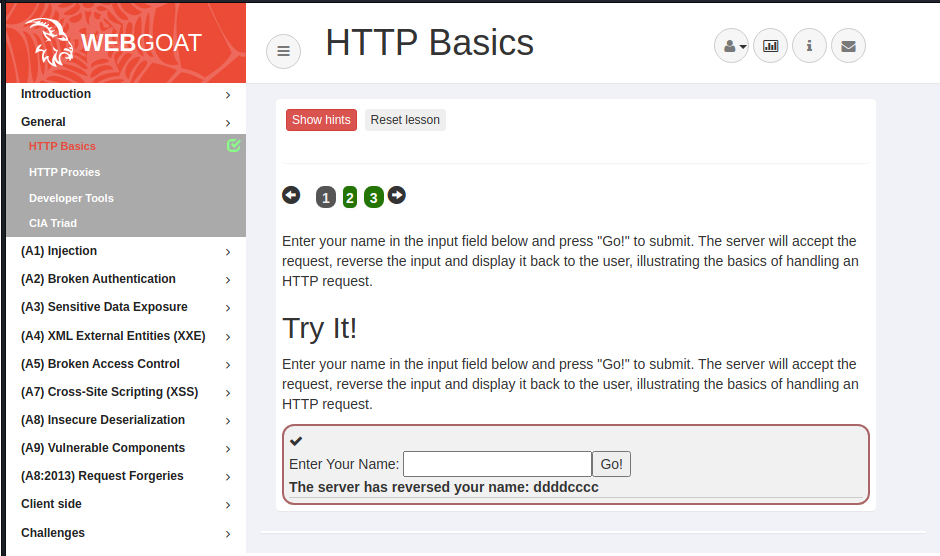
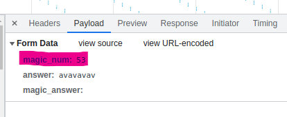
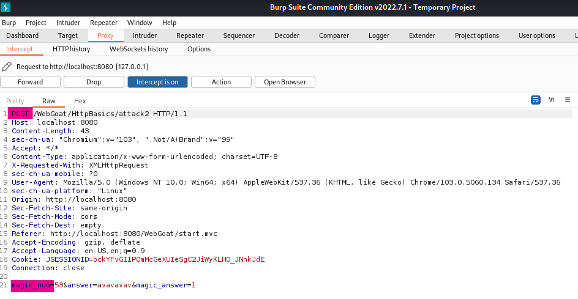

# Capturing network traffic, WebGoat and Darknet Diaries (h0-h1)
## Installing Kali-linux (h1-d)
At the beginning of this course I installed Kali-linux on VirtualBox by Oracle to do the tasks needed for the course work. Installation was simple using the documentation from [kali.org](https://www.kali.org/docs/virtualization/install-virtualbox-guest-vm/).

First step was to download the VirtualBox image which was readily available from the [kali.org virtual machines](https://www.kali.org/get-kali/#kali-virtual-machines) section.


After downloading it's useful to check that the SHA256 checksum from kali.org matches with the downloaded files checksum to make sure the file has not been tampered with during transit.

Checksum from kali.org for the file:


Checksum calculated using Microsoft Powershell Get-FileHash:


I already had Oracle VirtualBox installed on my Windows 10 desktop so adding the Kali-linux was simple. I did tweak a bit of the virtual machine properties and allocated a bit more memory and CPU for the VM.


## Network packet sniffing (h0-a)
When the Kali-linux was set up I thought about changing the default usernames and passwords of the virtual machine but decided that it's not worth the effort for these exercises at this point. I might change my mind later. Next I wanted to test that the setup works correctly so it was time to fire up Wireshark and capture some packets.

So the plan here is to:
1. Open Wireshark and CLI[^1] in Kali Linux
2. Start Wireshark capture on the network interface & create some network traffic with ping
3. Export the captured packets to a file
4. Analyze what happened

### 1. Open Wireshark and CLI in Kali Linux


### 2. Start Wireshark capture on the network interface & create some network traffic with ping

First we need to choose the network interface from Wireshark from which we want to capture the packets. In my case it will be the default network interface eth0. After this selection the capture will be live. On idle there should be little or no network traffic to or from Kali Linux so next we need to run a ping command on the CLI[^1]:

```
ping www.google.com -c 3
```

Then ping-command sends an echo request to the hostname you have specified using ICMP -protocol and if ICMP is enabled for the target we should get a response from it.


### 3. Export the captured packets to a file

File-menu > Export Packet Dissections > As Plain Text...


### 4. Analyze what happened

The first 4 packets here are DNS[^2] queries as you can see from the protocol and the info fields:


DNS[^2] is responsible for translating human readable network access information into IPv4 or IPv6 interpretations which the computers use communicate or vice versa.

Here we can see that there were two types of queries sent from my localhost to the DNS server configured for my local network. First query is type A query which means IPv4 version of the DNS[^2] query and the second type is AAAA query that will return an IPv6 response from the DNS server. And as we can see from the packet info we did actually get both IPv4 and IPv6 responses for www.google.com.

The next two packets are the echo packets for the ping-command. So in the first packet we're sending an ICMP request to the target asking for a reply and the second packet is the reply from the target host itself. Here on the highlighted echo request we can actually see that it was sent using IPv4.


After that we see another two DNS[^2] packets where my computer as the localhost is doing a PTR query (pointer) asking the DNS server for the hostname of the target and here the target is replying with the associated hostnames.


There is a lot more to analyze in these packets still and a lot of information that can be derived from these request and response packets such as port numbers, MAC addresses, etc. But that is a discussion for another time.


## WebGoat (h1-a, h1-b)
[WebGoat](https://owasp.org/www-project-webgoat/) is an open source web application whose development is lead by the OWASP[^3].

*"WebGoat is a deliberately insecure application that allows interested developers just like you to test vulnerabilities commonly found in Java-based applications that use common and popular open source components."*
Source: https://owasp.org/www-project-webgoat/

WebGoat is new to me so I haven't used or tried anything with this tool. Seems that in the Kali-Linux virtualbox image the necessary pre-requisites were in place for my installation and I proceeded to install and run the application as detailed in https://terokarvinen.com/2020/install-webgoat-web-pentest-practice-target/.

### HTTP Basics
In this section some basic concepts were discussed on how HTTP transfers data between the browser and the web application and these concepts were demonstrated by a couple of simple forms.



At the end of the section there was a quiz form where I needed to answer if the HTTP command was POST or GET and then find out the magic number for the second answer.

To find out the answer for the magic number you need to pop out the developer tools or use some of Kali-Linux installed proxy tools to intercept the HTTP request and reply. I decided to first try with the developer tools and opened it with F12 and popped it out on a separate window. After that I wanted to try the proxy approach too and opened Burp Suite from the Kali-toolkit and turned on packet interception with the proxy tool there. With both tools I was able to get the quiz done.

Here is the request on developer tools where under the headers you can see the request method which is POST:


And under the Payload-tab you can see the magic_num which was 53:



And same by using the Burp Suite:



## Bandit (h1-c)
Task was to solve the first three levels in [Bandit](https://overthewire.org/wargames/bandit/).

This site was completely new for me so I haven't visited this before. Let's see what we can find out :)

I won't be posting the solutions here as per the rules for the Bandit wargames but I will add a screencap as proof of access.

### Level 0
Task here was to login to the bandit game server using SSH port 2220 with the provided authentication details.

I did this in Kali-Linux that I installed to do the tasks for this course.

[bandit0](./bandit%20login.png)

### Level 1
Objective here was to login to the system with bandit1 privileges by getting the password from bandit0 files.

[bandit1](./bandit1.png)

### Level 2
Objective here was to find the secret for bandit2 user from an obscured filename.

[bandit2](./bandit2.png)

### Level 3
Another obscured filename puzzle.

[bandit3](./bandit3.png)

Pretty simple levels so far, took me 5 minutes to go from level 0 to level 3.


[^1]: Command-line interface
[^2]: Domain Name Service
[^2]: The Open Wep Application Security Project Foundation