# It's raining shells (h2)

## Conducting a penetration test with Metasploit (h2-x)

Task here was to read and summarize the chapter 1 "Penetration Test Using Metasploit" starting from "Conducting a penetration test with Metasploit" to the end of the chapter of "Mastering Metasploit" by Nipun Jaswal.

Here we started off by going through the basic terminology and some useful commands in the Metasploit framework from Metasploit and Meterpreter. Next in the article there were some of the benefits of using Metasploit listed:

+ It's an actively developed open source system
+ Metasploit supports large networks
+ Switching payloads is easy
+ Cleaner exit from compromised system

In my opinion having a database based solution with separate workspaces for results and reporting and also having an integrated exploit database in use are pretty big benefits too compared to manual hacking process.

Rest of the article was dedicated to a case study on how to gain access to an IP address using Metasploit. This case study covered:

+ Gathering intelligence
+ Using workspaces and databases in Metasploit
+ Nmap port scanning
+ Threat modeling
+ Vulnerability analysis
+ Exploitation
+ Lateral movement

## Installing Metasploitable 2 (h2-a)

Task here was to install Metasploitable 2 on a virtual machine in a separate virtual network with testing machine. I did this during the lessons already so the steps documented here are memorized:

1. Downloaded Metasploitable 2 from rapid7.com and verified the checksum.
2. Created a new virtual machine in VirtualBox and linked the downloaded disk to the VM
3. Created a new host-to-host virtual network on VirtualBox with DHCP
4. Configured the new virtual network to my Kali Linux testing machine and the Metasploitable2 VM
5. Tested communication between the VM's with ping

## Port scanning (h2-b)

Task here was to scan the Metasploitable 2 VM we installed for open ports and find information on what is running behind these open ports using various techniques. One of the central tools for this type of information gathering is Nmap which an open source network mapping tool (source: nmap.org). With Nmap scanning it is possible to find open ports and also gather information on what the applications/systems are behind those open ports.

Here I decided to run Nmap with the option -A which enables OS and version detection, script scanning, and traceroute. I also used the Metasploit framework to run it with the option to store the results into the Metasploit database and with the option to store the output to a file with standard Nmap output format.

```
db_nmap -A 192.168.134.3 -oN ./h2-homework/ip3.nmap
```

And afterwards you can see the results in Metasploit by issuing the command `services` which will returned:

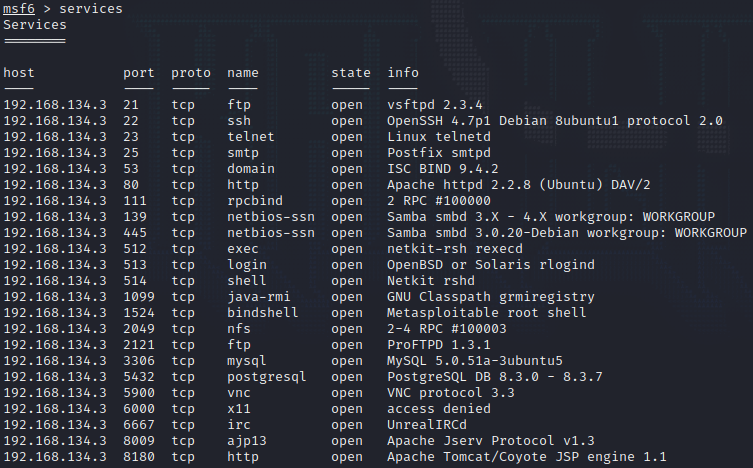

In the results we can see the port numbers and the protocol that is used there. With the '-A' option Nmap was able to determine some additional information about the service running in that port. Also all of the ports seemed to be in an open state which means that the application behind that port is actively accepting requests (source: https://nmap.org/book/man-port-scanning-basics.html). From this list of open ports the most interesting to me are telnet, ftp, http and smbd services. Telnet, ftp and http don't have encryption and thus are quite vulnerable and Samba smbd because you can get quite a lot of information from there pretty easily.

## Hacking into Metasploitable (h2-c, h2-d)

### Telnet

As my first approach I wanted to see if there is a way to get in using the port 23 where apparently a telnet server is running. Using the Linux telnet command I was able to get a connection and it didn't take much hacking to read the username and password from the connection message :satisfied:


### HTTP

The Metasploitable target had also two ports open accepting http requests which were ports 80 and 8180. Let's check these out just by using Firefox. Well on the normal HTTP port 80 the target also reveals the msfadmin username and password which we already got from the telnet server:

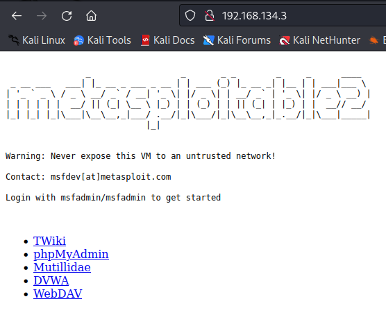

And on the second port 8180 we can see that Apache Tomcat 5.5 is installed there:

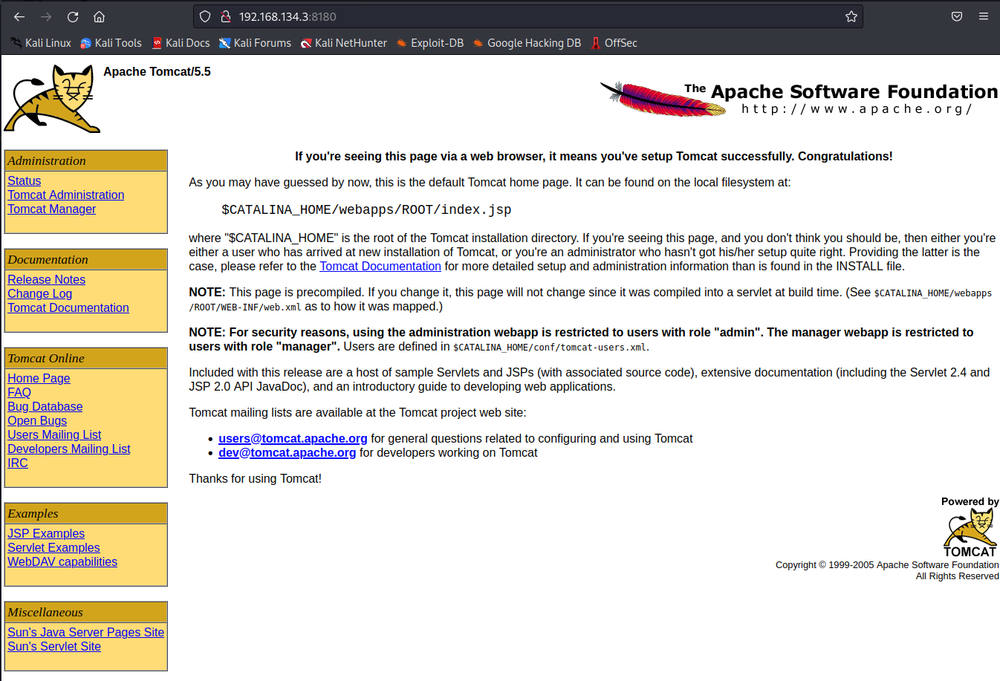

Let's try to get into the Tomcat Administration to see what's there.

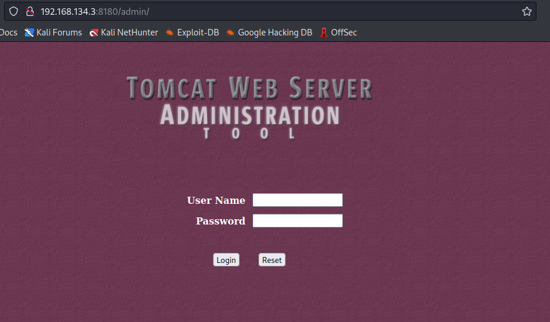

Here the msfadmin username and password don't work so we need to see what other options we have to get in. First I'll check if the default passwords will get us access. Kali Linux does have Hydra installed and some ready made default password lists which I'm going to use. First I'll check the method type and link for the request using Buprsuite:


Then I'll run Hydra with the infomation I got from the Burpsuite intercept:

```
hydra -L /usr/share/wordlists/metasploit/tomcat_mgr_default_users.txt -P /usr/share/wordlists/metasploit/tomcat_mgr_default_pass.txt 192.168.134.3 -s 8180 http-get /manager/html
```

It appears that there were several matches:


From these matches the combination of username: tomcat and password: tomcat gave access to the Tomcat Manager GUI:


And it seems that with the same password and username combination we get access to the administration tool as well:


### Samba

Regarding to the Samba file shares I found some information about the service in the Nmap scan. This is the portion from the log file I saved:

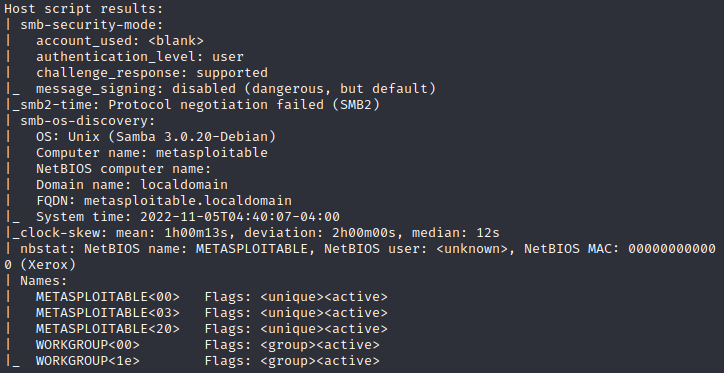

Here we can see that the Samba version is 3.0.20 and we also see the FQDN and names for NETBIOS. Lets check if we find some interesting exploits from Metasploit with `search samba`.

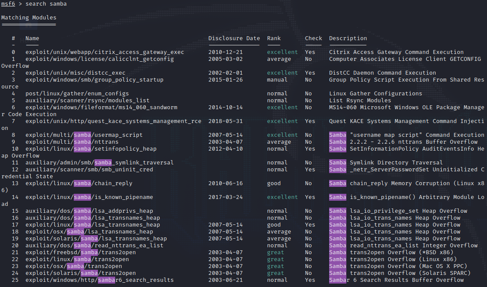

Number eight looks interesting so lets check the information for that exploit using `info 8`.

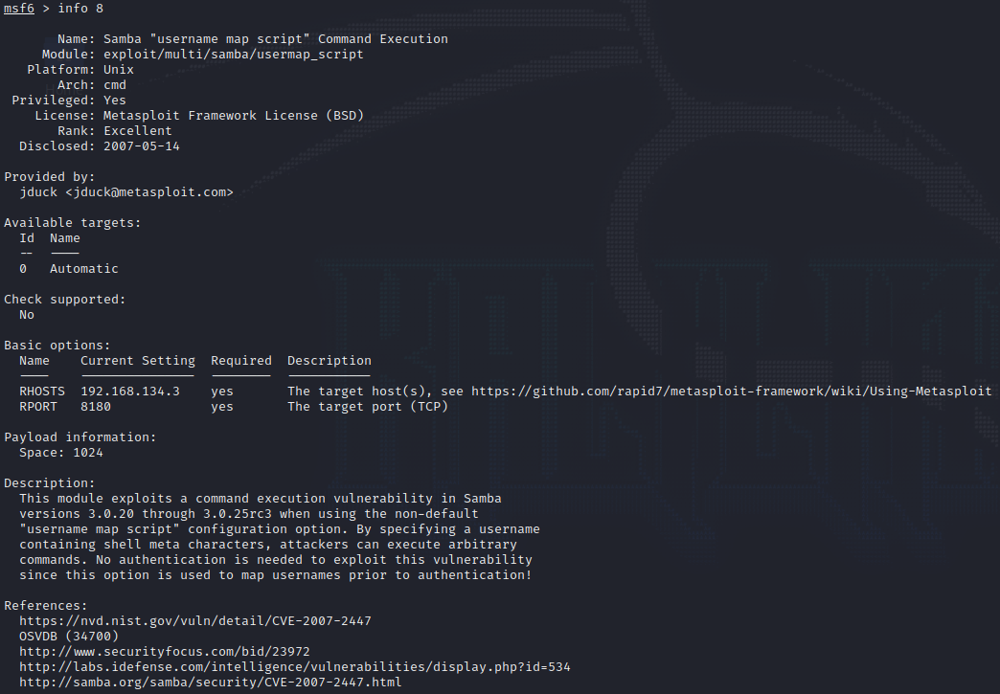

Seems like the Samba version that is running on Metasploitable2 is vulnerable for this exploit so lets go ahead with that. And good enough after trying out a few different payloads we get root in the system with 'payload/cmd/unix/bind_netcat':


We're also able to upgrade the shell to Meterpreter shell by using 'shell_to_meterpreter'.

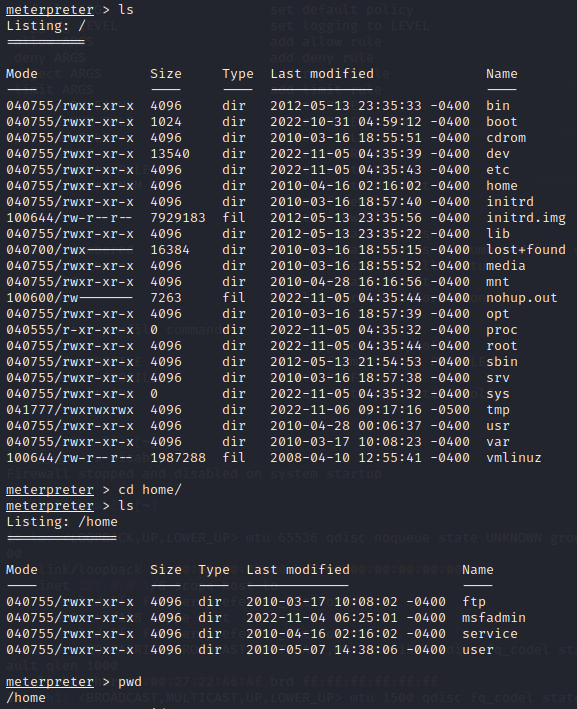

## VulnHub THE PLANETS: MERCURY (h2-e)

Here I started off with Nmap scan of the target and found out that the machine has two open ports.


From there I went to check what the machine would return with browser in port 8080 and got just a simple message that the site is under development. From there I went on to run dirb on the site which found robots.txt from the server. From there I decided to try some foobar entries to see what the site would give in return and got this:


There I noticed the mercuryfacts entry and put that in the browser and this came up:

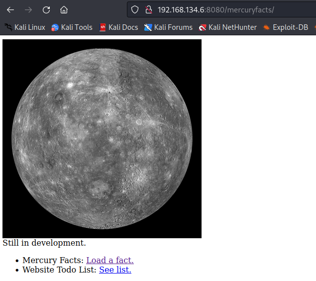

Checked the links on the page and in the Still todo pages noticed that page might be using direct MySQL call so I decided to try and see if I get some information about the server using SQL injection. I ran some SQL commands myself on the url but quickly decided to check if Kali had any tool to help with this to get the necessary information faster. Found sqlmap from the applications and decided to give it a try. After some trial and error and a bit of help from sqlmap.org I managed to get information from the server database by doing:

```
sqlmap 'http://192.168.134.6:8080/mercuryfacts/1' --schema
```

From the log I found that there is a database called mercury with a table users which has potentially usernames and passwords stored. Lets see if I can get those entries to see what they are.

```
sqlmap http://192.168.134.6:8080/mercuryfacts/1 -D mercury -T users -C username,password --dump
```

Results:


Next step is to check if any of these work with the SSH that is on the machine and sure enough the webmaster had SSH access. However I'm screwed since I tried to do sudo an now I might have been noticed :S I guess I should've checked before trying...

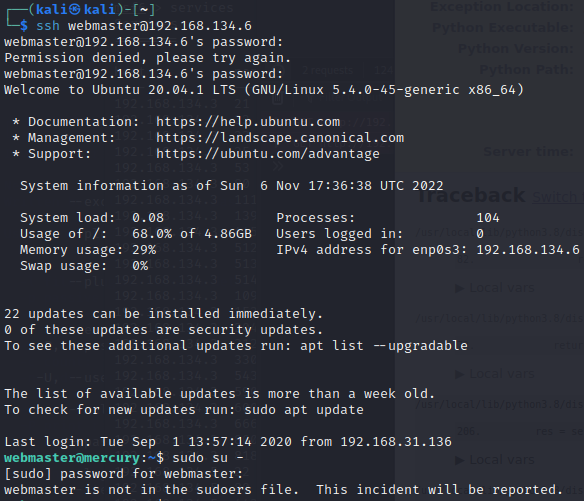

Now how do we get our access privileges escalated. I ended up searching the internet for some suggestions and came onto this Metasploit tool to check for local exploits 'multi/recon/local_exploit_suggester' (source: https://null-byte.wonderhowto.com/how-to/get-root-with-metasploits-local-exploit-suggester-0199463/). Here I actually found a couple of exploits that the system was vulnerable for:

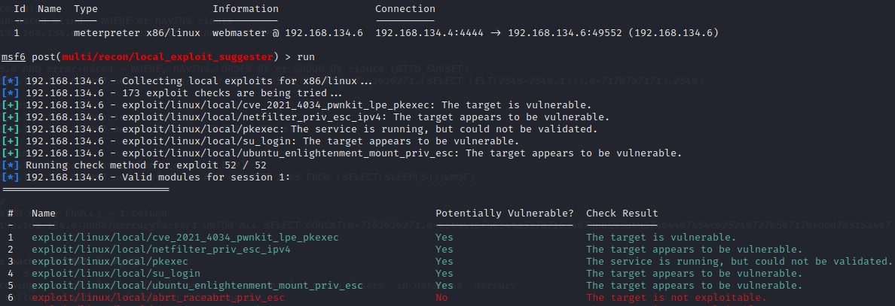

From these I decided to go with the first one 'linux/local/cve_2021_4034_pwnkit_lpe_pkexec' and this indeed got me root privileges and I was able to find the /root/root_flag.txt.

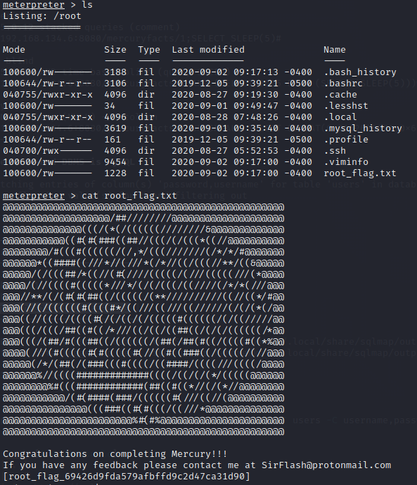
