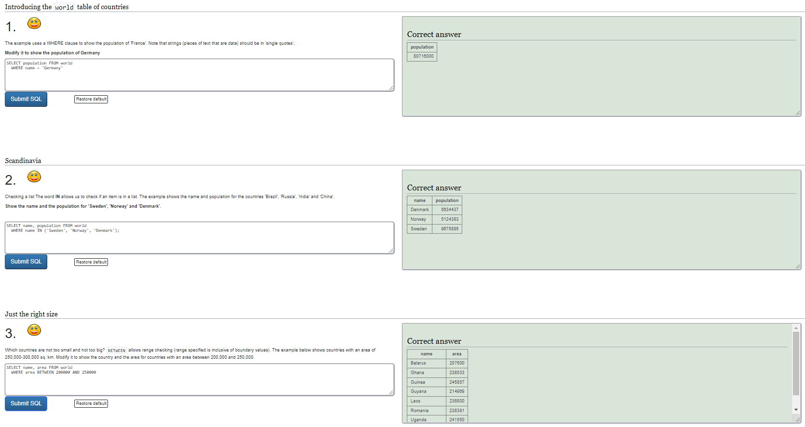

# SELECT pwned

## OWASP 10

### A1 Injection
+ Common injection types are SQL, OS command, and LDAP.
+ Applications are vulnerable when user-supplied data is not validated, filtered or sanitized by the application
+ Impact of the injection can be severe and result to a complete host takeover
+ Injections are done by inserting hostile code into SQL calls and other queries

### A2 Broken Authentication
+ There are many ways authentication can be broken: weak hash or plain text passwords in the system, no preventive measures for brute force attacks or automated attacks, failure to handle sessions in a secure way, etc
+ Users can prevent falling victim by using different strong password in all systems and activating MFA (multi-factor authentication) when possible
+ Most common attack type is credential stuffing where the attacker uses a list of known passwords to gain access to the system

### A3 Sensitive Data Exposure
+ Common attack types are man-in-the-middle attack or stealing clear text data/secrets off the server or from the user while the data is in transit from the client
+ Can be prevented by encrypting data in transit and at rest and making sure no unnecessary data is stored

### A7 Cross-Site Scripting (XSS)
+ There are three types of XSS attacks: Reflected, Stored and DOM
+ Typical XSS attacks include session stealing, account takeover, MFA bypass, keylogging, malicious downloads, and DOM node replacement or defacement

## The Complete Ethical Hacking Course (video): Chapter 21: Cross Site Scripting
+ Here the lecturer introduced two-types of XSS attacks (reflected and stored) and demonstrates how they can be exploited
+ BeEF is a tool that can be utilized with stored XSS attack to run malicious code on the client machine
+ Also the lecturer showed how to protect yourself against some types of attacks by changing the javascript settings on the browser

## XSS story (h3-x)
On a beautifyl Sunday morning Tero wakes up and turns the coffee machine on. His routine includes reading the news from his new ultra widescreen display while sipping coffee. He casually browses around the internet news sites and for no particular reason he decides to check his emails as well.

As he casually checks the inbox for unread messages he notices an important email from his favourite news site that there has been multiple failed logins and that he should check and confirm if these logins were indeed made by him and not by some malicious attacker. Cold sweat starts to drizzle from Tero's temples as he surely hasn't tried to login to the site in the middle of the night!

In a moment of panic Tero decided that for sure this needs to be checked. Luckily the news site had included a link in the email from where he could review the incidents reported. Tero clicks the link and is directed to the news site login page where he's required to provide his credentials. Tero logs in and to his relief the report there shows that there is no need for further actions as these attempts were indeed already identified as false logins and dealt with accordingly. Tero calms down and is instantly relieved that his favorite news agency indeed was on top of things.

As he leans in for his coffee cup and starts slowly to take his next sip the speakers burst out the first notes from James Brown's 'I feel good' at an insanely loud volume! Tero jumps to the air and spills the cup of semi-hot coffee all over himself and his brand new widescreen display. Sunday is ruined!

Little did he know that the email was indeed from an attacker who used the news site to run malicious code on Tero's browser. Not only did the attacker get Tero's login details he also ruined the normally blissful Sunday coffee moment for Tero.

## SQLZoo (h3-a)

### 0 SELECT basics
Here the basics of the SQL SELECT statement were introduced with by a few simple tasks of replacing parameters to get different results.

### 2 SELECT from tasks 1-5
Here the tasks included some basic SQL SELECT statements to be made to retrieve certain information and do some simple calculations. On a side note it's useful to use the AS statement to rename the calculated fields correctly.

## Darn Low Security

## Webgoat

### SQL injections (h3-d)
I did this previously already, here is the link:

https://github.com/arcane-tl/coursework/blob/main/Penetration%20Testing/h0-h1/h0-h1.md#a1-injection

### A2 Broken authentication:
Authentication bypasses: 2 2FA Password Reset
### A3 Sensitive data exposure
Insecure Login: 2 Let's try
### A7 Cross Site Scripting (XSS): Cross site scripting
2 What is XSS?
7 Try It! Reflected XSS
### A8:2013 Request Forgeries:
Cross-Site Request Forgeries
3 "Basic Get CSRF Exercise"
4 "Post a review on someone else’s behalf".