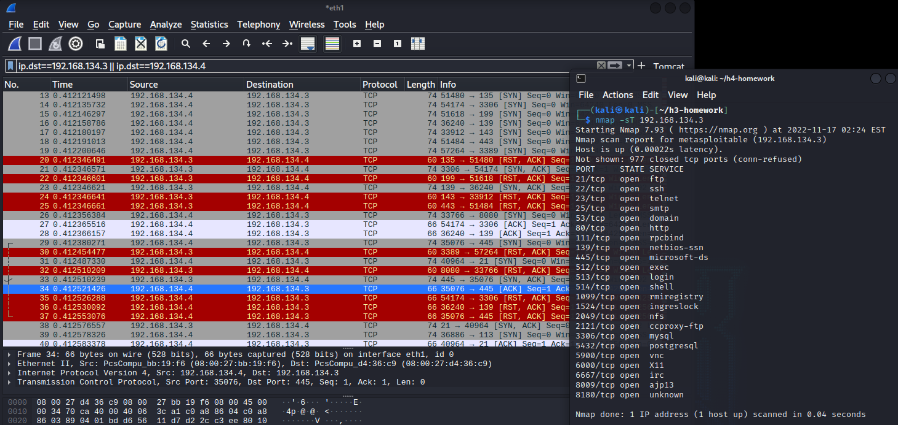

# Intelligence Cap (h4)

## Read and summarize (h4-z)
The idea was to read and summarize the contents:
+ https://learning.oreilly.com/videos/the-art-of/9780135767849/9780135767849-SPTT_04_00
+ https://nmap.org/book/nmap-overview-and-demos.html
+ https://nmap.org/book/man.html
+ https://nmap.org/book/man-port-scanning-basics.html
+ https://nmap.org/book/man-port-scanning-techniques.html
+ man nmap (Nmap manual)

### Art of hacking - Active Reconnaissance

+ Active reconnaissance means sending and querying information from the target network which means there will be traces of ones actions in the log files and intrusion prevention systems
+ A common mistake is going straight into vulnerability scanning without doing a proper network scan
+ Tools for port scanning: Nmap, Masscan, Udpprotoscan and for webservice scanning EyeWitness
+ Vulnerability scanners are commonly categorized into network- and web vulnerability scanners

### Nmap Network Scanning - Getting started

+

## Network scanning with Nmap
Here I used the Nmap tool to scan the target with specific attributes and monitored the scanning with Wireshark to be able to analyze what happens during the scan.

## nmap TCP connect scan -sT (h4-a)
Here Nmap sends SYN packets to 1000 most common ports and uses the ACK packets to determine if the target is actually alive. As we see in the screen capture below Nmap results correlate with the packets monitored in the Wireshark display where [SYN, ACK] packets correlate to ports in the Nmap report.

If you want more information on which 1000 ports specifically are scanned you can run Nmap with the following parameters ´nmap -sT 192.168.134.3 -v -oG ports_scanned.txt´ and check the ports from the file generated.

Here is an example from port 445 of -sT connect type scan:

## nmap TCP SYN scan -sS (h4-b)

