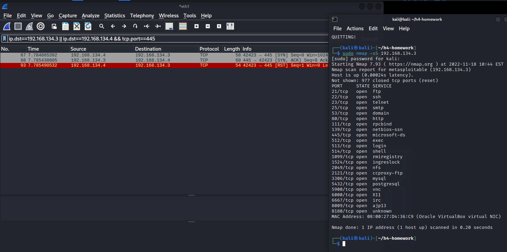
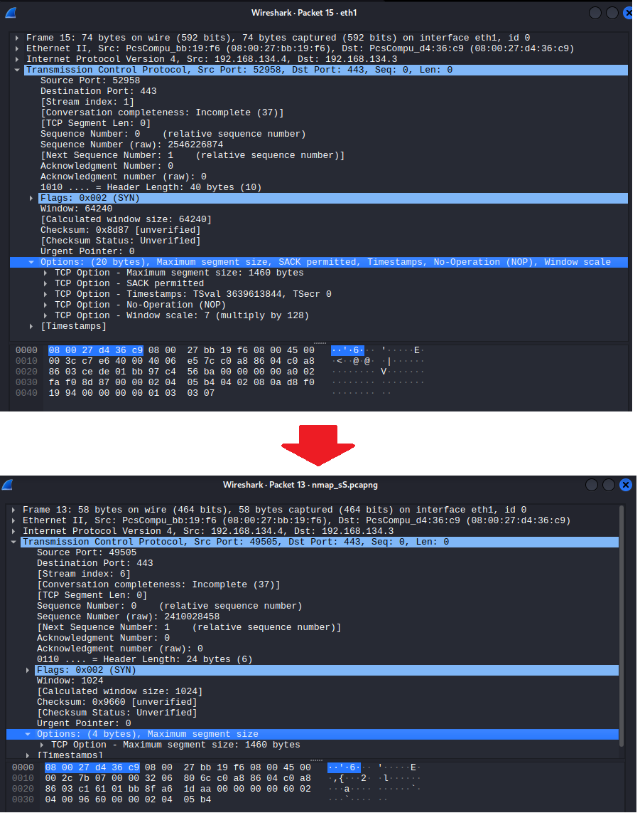
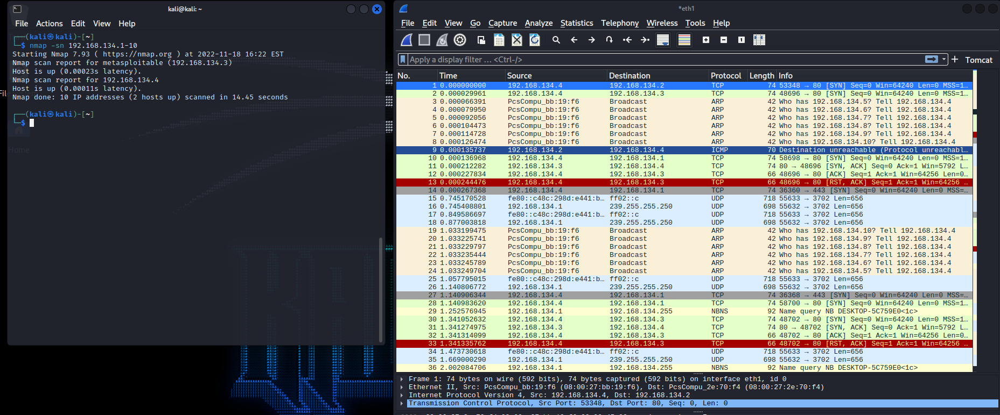
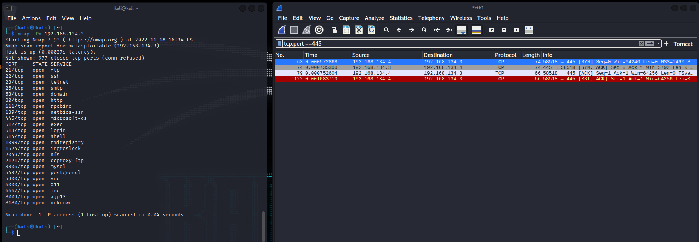
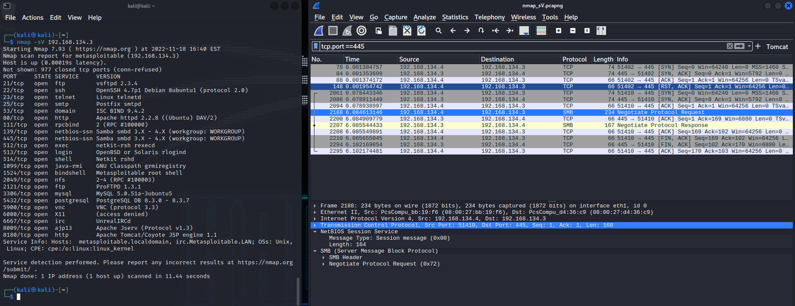
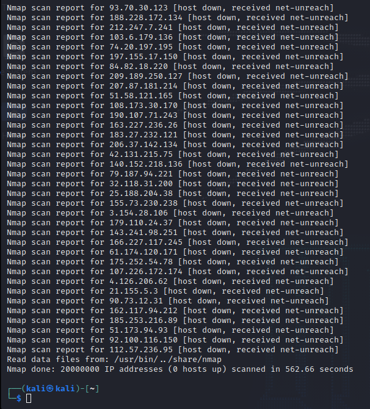
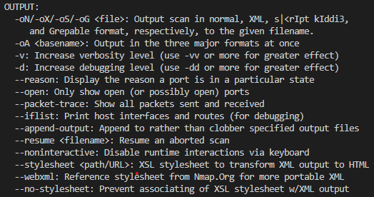
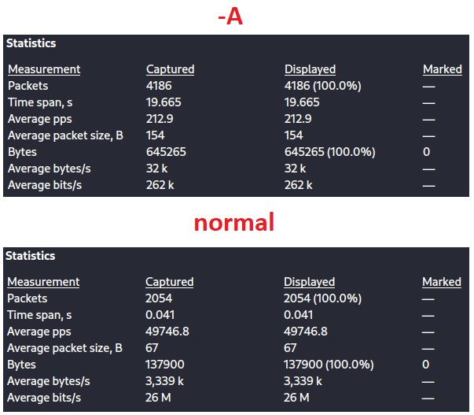
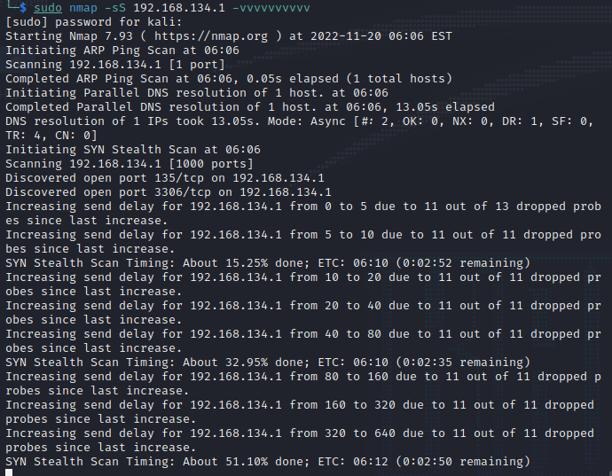
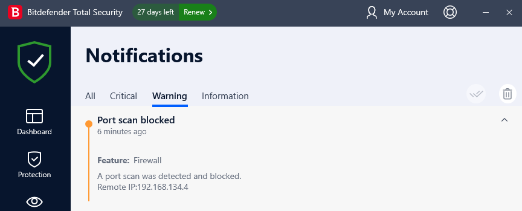

# Intelligence Cap (h4)

## Read and summarize (h4-z)
The idea was to read and summarize the contents:
+ https://learning.oreilly.com/videos/the-art-of/9780135767849/9780135767849-SPTT_04_00
+ https://nmap.org/book/nmap-overview-and-demos.html
+ https://nmap.org/book/man.html
+ https://nmap.org/book/man-port-scanning-basics.html
+ https://nmap.org/book/man-port-scanning-techniques.html
+ man nmap (Nmap manual)

### Art of hacking - Active Reconnaissance

+ Active reconnaissance means sending and querying information from the target network which means there will be traces of ones actions in the log files and intrusion prevention systems
+ A common mistake is going straight into vulnerability scanning without doing a proper network scan
+ Tools for port scanning: Nmap, Masscan, Udpprotoscan and for webservice scanning EyeWitness
+ Vulnerability scanners are commonly categorized into network- and web vulnerability scanners

### Nmap Network Scanning - Getting started

+ Ports can be determined as open, closed, filtered, unfiltered, open|filtered, closed|filtered
+ Open status means that the port is actively accepting connections and packets on the port
+ Closed ports are still reachable but there is no application listening on it.

## Network scanning with Nmap
Here I used the Nmap tool to scan the target with specific attributes and monitored the scanning with Wireshark to be able to analyze what happens during the scan.

### nmap TCP connect scan -sT (h4-a)
Here Nmap sends SYN packets to 1000 most common ports and uses the ACK packets to determine if the target is actually alive. As we see in the screen capture below Nmap results correlate with the packets monitored in the Wireshark display where [SYN, ACK] packets from the host correlate to ports in the Nmap report.


If you want more information on which 1000 ports specifically are scanned you can run Nmap with the following parameters ´nmap -sT 192.168.134.3 -v -oG ports_scanned.txt´ and check the ports from the file generated.

Here is an example from port 445 of -sT connect type scan where we can see that the host also finishes the TCP connection by sending ACK packet to the target before terminating the connection:


### nmap TCP SYN scan -sS (h4-b)
SYN scan is similar to the connect() scan but here the TCP connection will be terminated without the host sending ACK packet. This option also runs the scan towards the 1000 default ports configured into Nmap.



With this option the SYN packet is also generated by Nmap and it's not using the system default connect method thus also needing superuser privileges to be initiated. The difference between the SYN packets can be seen from Wireshark when you compare the packets from different scans. Here we can observe that the packet options differ a lot:



### nmap ping sweep -sn (h4-c, h4-l)
Nmap -sn uses ARP protocol to broadcast query for hosts in the network. Hosts that answer the ARP broadcast with their MAC are identified as being available. Running Nmap -sn with root privileges results in a clean ARP query log in Wireshark as seen below.


However running it without root privileges results in some TCP and ICMP packets alongside ARP broadcasts.



I also noticed here while testing this that when checking what packets are moving during ping requests there might be some difference in results if the ARP table on the computer is populated or no. Didn't go too deep into this but was interesting to see that it had an effect on whether ARP broadcasts showed before ICMP packets or after them. This might also have an effect on other ARP related queries.

### nmap don't ping -Pn (h4-d)
This seems to do the same scan as -sT option.



### nmap version detection -sV (h4-e)
This scan does the normal connect() scan to the ports and after verifying the open ports it continues to poll the ports with some identifying requests like seen below with the SMB protocol.



### nmap port selection -p1-100, --top-ports 5, -p- (h4-f)
+ First option ´nmap -p1-100 192.168.134.3´ only scans the hosts for ports 1-100.
+ Second option ´nmap --top-ports 5 192.168.134.3´ only scans the 5 most common ports which are 23,22,21,80 and 443.
+ Third option ´nmap -p- 192.168.134.3´ scans the hosts for all the possible ports 1-65535. It does not scan port 0 which is considered as a wildcard port and can sometimes yield some insight about the target. This can be scanned using ´nmap -p0 192.168.134.3´


### nmap targets and ranges (h4-g)
Nmap allows the targets for the scans to be chosen in various ways. Most common way would be to just type in the target as an single IPv4 address ´nmap 192.168.134.3´. Another way to specify the targets is to give a range of addresses for nmap either by defining the range with a dash for a single subnet ´nmap 192.168.134.1-5´.

For multiple subnets one would use a network mask to define the targets since it's not possible to scan multiple subnets using a dash notation. Network mask is defined after the ip-address with '/' like so:
```
nmap 192.168.0.0/16
```
This notation would mean that all the subnets and hosts would be scanned from combinations formed from x.x.0-255.0-255.

IPv4 standard (https://www.rfc-editor.org/rfc/rfc2734.html) describes how the network mask is defined but for short it goes in 8-bit increments where /0 mask would represent the entirety of IPv4 addresses and /32 would point to only a single host.

For pentesting another option is also good which is using hosts from an inputfile. This way one could document or collect interesting IP-addresses during passive recon phase to an inputfile and then later use that file in the active recon phase to scan them.
```
nmap -iL interesting_ips.txt
```

While I was researching the options here I noticed that one could also exclude addresses which is good if you know that something is a honeypot or a high risk target you don't want to lay hands on during the early phases of pentesting. There was also to my amazement a possibility to choose random targets with the option -iR. No idea where that would be useful other than some good old beer boozing fun. For the heck of it I ran ´nmap -iR -vv 2000000´ to see if it would pick a host from my subnet eventually but sadly it didn't.



Here are all the options for choosing the targets from ´nmap --help´:


### nmap output files -oA foo (h4-h)
With Nmap one can also use output files for the scan results and this is often times a good idea since running scans while you are staring the screen is not particularly efficient. Here it is important to choose you verbosity level and debug options if necessary to get all the details needed into the output files.

Here is the options available in nmap --help:



Normal form is good for browsing the scan results but it isn't best suited for automating next steps using scripts or code. For this kind of use XML-format might be the best so that you can read in the results and use code to pick the information specifically that you would like to use next moving forward.

### nmap runtime interactions (h4-k)
During a scan one can modify settings for the standard output of the scan. All the options available can be seen by pressing '?' during the scan:


Changing verbosity up (v) or down (V) effects on the detail which Nmap will give about the actions and the results of the scan under the hood. Increasing the debugging option will give you insight on how the Nmap code is working and if there are errors regarding how Nmap is running. Packet tracing will give insight on what kind of packets are sent to the target.

### nmap comparing statistics normal scan to -A scan (h4-m)
Here I tried out the -A option which scans the target with OS detection and other scripting options. With this method you get a lot more information but also the risk of detection grows a lot since the scanning time grows and the scripts used apply multiple different scanning techniques that can be spotted by IDS, logging, etc. Scanning Metasploitable2 took 19.91 seconds with the -A option where as it only took 0.04 seconds with the normal Nmap scan.

Total amount of packets recorded for -A was 4186 where with the normal scan the amount was 2054 which is less than 50% in comparison. Packets sent were 2255 for the -A scan and 1051 for the normal scan.



Also notable here is the average packet size which is over double on the -A scan than with the normal scan. This also shows on the bytes captured where normal scan only shows data for roughly 135Kb and the -A scan goes to 630Kb.

### Ninja scanning with Nmap (h4-d2)
Here I decided to test how well one can hide Nmap scans towards a machine with a commercial anti-virus and personal firewall installed. In this case I decided to use my home computer as target practice. My rig has Windows 10 installed with BitDefender total protection installed and I wanted to see if it would detect some of my feeble scanning attempts.

´nmap -sS 192.168.134.1´

BitDefender detected the port scan and blocked it after which Nmap started to increase the send delay due to dropped packets.




### UDP services (h4-e)
UDP short for User Datagram Protocol is a networking protocol that is commonly used in time-sensitive communications like voicem, video and online gaming. According to nmap.org widely used services using UDP are DNS, SNMP and DHCP. Nmap also has -sU parameter that will enable Nmap UDP port scanning while doing a SYN scan for example.

sources:

https://nmap.org/book/scan-methods-udp-scan.html

https://www.cloudflare.com/learning/ddos/glossary/user-datagram-protocol-udp/

### UDP port scanning (h4-e)
UDP scanning unreliable due to the fact that it's a connection-less protocol meaning that the target receiving the packets does not send a packet back to confirm the packet has been received. Also the method of identifying open UDP ports relies on receiving ICMP destination port unreachable packets and ICMP packets are in many cases blocked by firewalls, IDS and even some operating systems.

sources:

https://support.languard.gfi.com/hc/en-us/articles/360015159919-Resolving-UDP-scan-is-not-reliable-on-this-machine-Error-when-Scanning