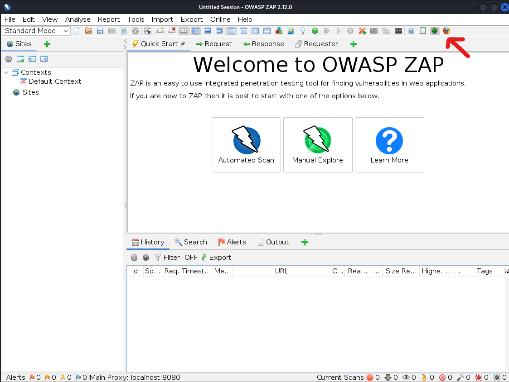
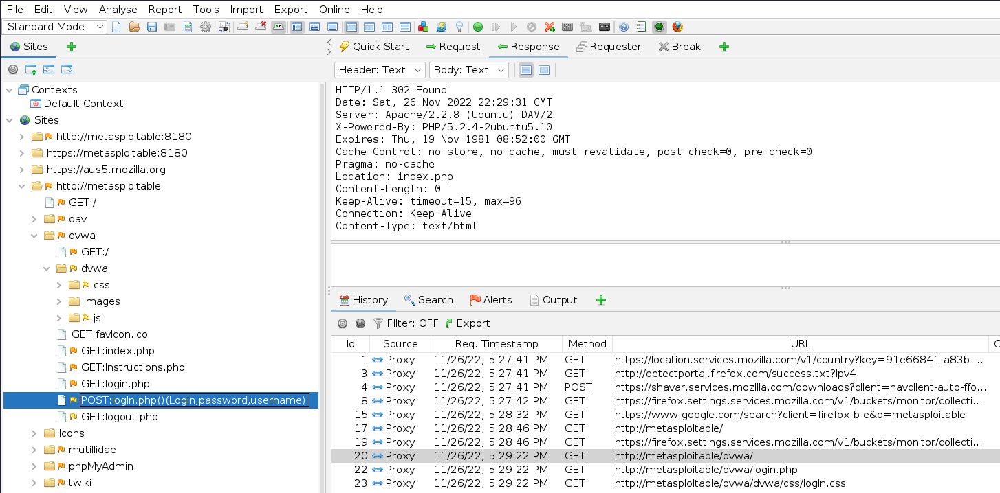
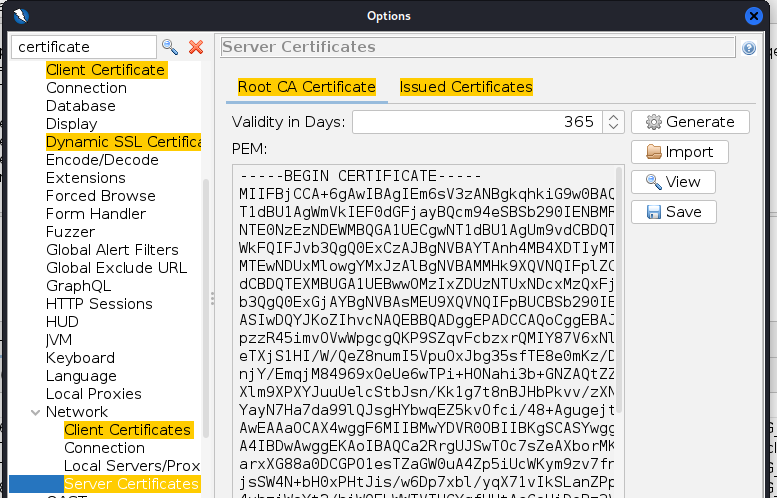
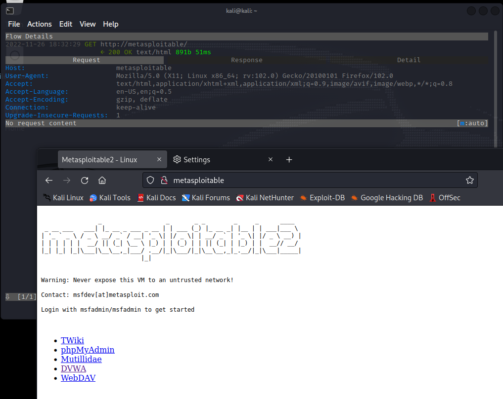
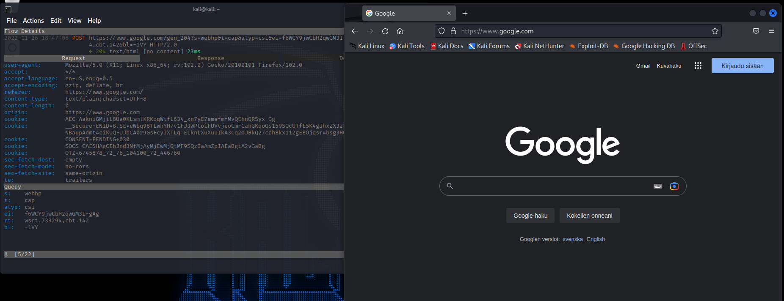

# OSINT & web proxy
Tasks from https://terokarvinen.com/2022/tunkeutumistestaus-ict4tn027-3010-syksylla-2022/

## [A Beginner's Guide to Social Media Verification](https://www.bellingcat.com/resources/2021/11/01/a-beginners-guide-to-social-media-verification/) (h5-x)
+ Information verification of information is key to battle misinformation and disinformation
+ Verification doesn't require complicated algorithms or programs that automatically detect image manipulation
+ Steps of infromation verification for videos and photos are originality, who is the source, where was it taken, when it was captured, and why it was captured
+ Look for clues in the material such as usernames for social media platforms, identifiable objects, text, or form and use common search engines or platform search to find more information about these clues
+ Use simple key phrases to search for similar material in other platforms and apply basic critical thinking to extract information
+ Use reverse image search to see if the material has surfaced before or somewhere else
+ Look for signs of image manipulation
+ Thorough investigation can take months in most complex cases and binary answer might not be possible
+ Tools and methods may vary but key factors should always be considered when verifying content

## OSINT sources in Finland (h5-y)
Here are some OSINT sources for Finland:
+ Yritys- ja yhteisötietojärjestelmä (ytj.fi) - information about businesses and key stakeholders
+ Fonecta (fonecta.fi) - contact information, business and services information
+ Traficom (traficom.fi) - vehicle information, network domain information

## Webproxies

### Install and capture traffic with ZAP (h5-a)
Here I fired up my Kali Linux virtual machine on VirtualBox and installed ZAP `sudo apt-get install zaproxy`. After installation I cut down the network connection to public network and fired up my Metasploitable2 virtual machine to test the ZAP proxy. Next I started Firefox from ZAP using the button on the top bar:

Using the browser to load metasploitable web page I was able to capture some http traffic:

### Capture TLS encrypted traffic with ZAP (h5-b)
Next it was time to import the ZAP proxy CA certificate into Firefox to capture some https. I went ZAP GUI and from Tools-menu chose the Options and from under Network there is the option of Server Certificates from where you can save the certificate.

I saved the certificate to a file which I then imported into the Firefox browser using the Certificate Manager from Firefox Settings:

After that I enabled the network connection briefly to test https://google.com to capture a few https packets.

### Install and capture traffic with Mitmproxy (h5-c)
Next it was time to test Mitmproxy. This comes pre-installed in Kali Linux so I didn't have to install it manually. I started Mitmproxy with `mitmproxy` and added my localhost:8080 as the proxy server for Firefox and voilá:

### Capture TLS encrypted traffic with Mitmproxy (h5-d)
For HTTPS traffix I needed the mitmproxy CA certificate to be installed in the browser. After checking the documentation the certificate was found in ~/.mitmproxy/mitmproxy-ca-cert.pem (https://docs.mitmproxy.org/stable/concepts-certificates/). I copied the file from there to my home folder using `cp` and then imported it to Firefox and got HTTPS traffic captured as well:

### Solve a Webgoat task (h5-e)
I've solved a couple already before in the optional tasks with Burp (https://github.com/arcane-tl/coursework/blob/main/Penetration%20Testing/h3/h3.md#jwt-tokens-optional).